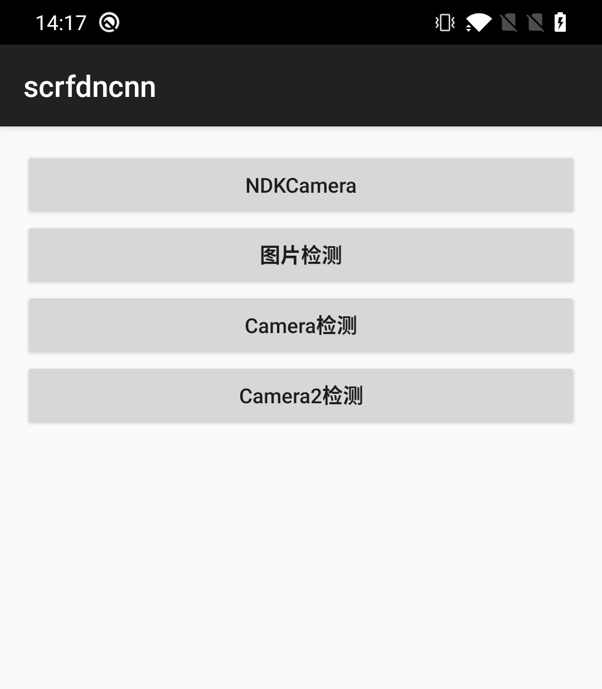
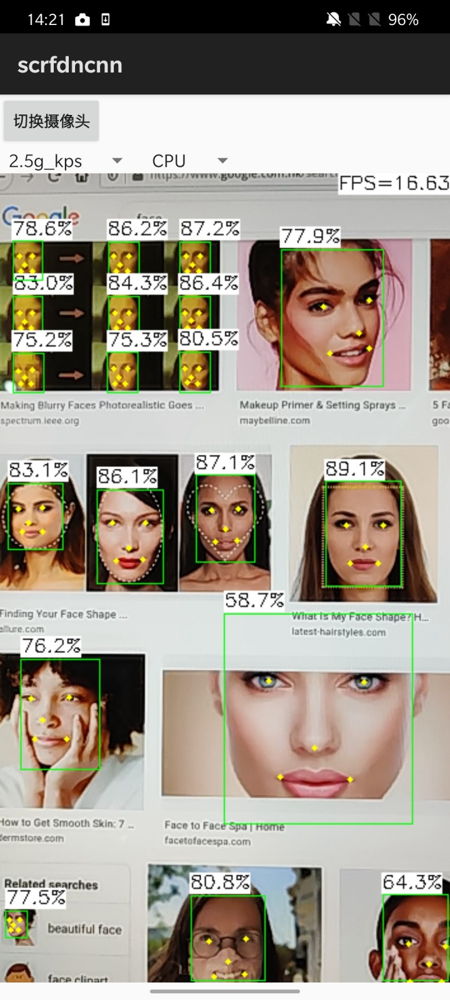

# 说明

该项目原版地址：https://github.com/nihui/ncnn-android-scrfd ，是ncnn作者nihui开源的人脸项目

项目中操作摄像头使用了`ndkcamera`，对于普通Android开发者这不是常用和熟悉的方式，因此我对该项目进行了一些扩展

# 修改

1. 使用了`android.hardware.Camera`和`android.hardware.camera2`的API在java层操作摄像头并获取预览数据（NV21）
2. `SCRFDNcnn.java`中增加如下jni接口，方便我们在java层检测人脸

```java
    /**
     * 创建
     *
     * @return
     */
    public native boolean create();

    /**
     * 销毁
     *
     * @return
     */
    public native boolean destroy();

    /**
     * NV21转RGB数据
     *
     * @param yuv    NV21数据区
     * @param rgb    RGB数据区
     * @param hw     hw[0]:宽，hw[1]:高
     * @param rotate 旋转角度：0，90，180，270
     */
    public native boolean NV21RotateToRGB(byte[] yuv, byte[] rgb, int[] hw, int rotate);

    /**
     * 检测人脸
     *
     * @param rgb    图像RGB数据
     * @param width  图像宽
     * @param height 图像高
     * @return 人脸数据
     */
    public native Face[] detectRGB(byte[] rgb, int width, int height);

    /**
     * 检测NV21数据
     *
     * @param nv21        NV21数据
     * @param width       图像宽
     * @param height      图像高
     * @param orientation 图像旋转方向
     * @return
     */
    public native Face[] detectNV21(byte[] nv21, int width, int height, int orientation);
```

3. 提供了几种示例

   <table>
     <tr>
       <td><b>示例</td>
       <td><b>说明</td>
     </tr>
     <tr>
       <td>NDKCamera</td>
       <td>原版功能</td>
     </tr>
     <tr>
       <td>图片检测</td>
       <td>对BItmap进行检测</td>
     </tr>
     <tr>
       <td>Camera检测</td>
       <td>使用Camera1检测人脸，预览和检测不同线程<br><b>优点</b>：预览独立运行不会出现卡顿延迟<br><b>缺点</b>：人脸移动时人脸框会有延迟</td>
     </tr>
     <tr>
       <td>Camera2检测</td>
       <td>使用Camera2检测人脸，检测完后再将检测的这一帧用OpenGLES渲染<br><b>优点</b>：人脸框紧跟人脸<br><b>缺点</b>：检测慢的情况下预览会卡顿延迟</td>
     </tr>
   </table>

<p align="center"></p>

4. 本项目中我删除了assets中大部分的模型文件，只保留了500m模型，目的是为了减小上传下载的压力。如果你需要更多的模型，请下载原项目拷贝模型到assets目录即可。

# 其它

项目中Camera封装和使用OpenGLES预览YUV在我的如下两个项目中有讲解

Camera：https://github.com/xiaozhi003/AndroidCamera

OpenGLES预览YUV：https://github.com/xiaozhi003/AndroidOpenGLDemo

# ncnn-android-scrfd

The SCRFD face detection

This is a sample ncnn android project, it depends on ncnn library and opencv

https://github.com/Tencent/ncnn

https://github.com/nihui/opencv-mobile

## android apk file download
https://github.com/nihui/ncnn-android-scrfd/releases/latest

## how to build and run
### step1
https://github.com/Tencent/ncnn/releases

* Download ncnn-YYYYMMDD-android-vulkan.zip or build ncnn for android yourself
* Extract ncnn-YYYYMMDD-android-vulkan.zip into **app/src/main/jni** and change the **ncnn_DIR** path to yours in **app/src/main/jni/CMakeLists.txt**

### step2
https://github.com/nihui/opencv-mobile

* Download opencv-mobile-XYZ-android.zip
* Extract opencv-mobile-XYZ-android.zip into **app/src/main/jni** and change the **OpenCV_DIR** path to yours in **app/src/main/jni/CMakeLists.txt**

### step3
* Open this project with Android Studio, build it and enjoy!

## some notes
* Android ndk camera is used for best efficiency
* Crash may happen on very old devices for lacking HAL3 camera interface
* All models are manually modified to accept dynamic input shape
* Most small models run slower on GPU than on CPU, this is common
* FPS may be lower in dark environment because of longer camera exposure time

## screenshot


